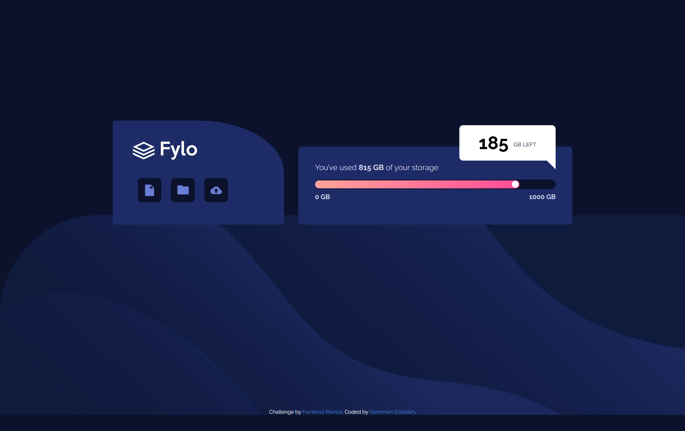

# Frontend Mentor - Fylo data storage component solution

This is a solution to the [Fylo data storage component challenge on Frontend Mentor](https://www.frontendmentor.io/challenges/fylo-data-storage-component-1dZPRbV5n). Frontend Mentor challenges help you improve your coding skills by building realistic projects.

## Table of contents

- [Overview](#overview)
  - [The challenge](#the-challenge)
  - [Screenshot](#screenshot)
  - [Links](#links)
  - [Built with](#built-with)
  - [What I learned](#what-i-learned)
- [Author](#author)

## Overview

### The challenge

Users should be able to:

- View the optimal layout for the site depending on their device's screen size

### Screenshot

### Links

- [Solution URL](https://your-solution-url.com)
- [Live Site URL](https://hammam-elsheikh.github.io/fylo-data-storage-component/)

## My process

### Built with

- Semantic HTML5 markup
- scss
- Flexbox
- Mobile-first workflow

### What I learned

one rounded corner
background shorthand
linear-gradient
overlay progress bar

## Author

- Linkedin - [@hammam-elsheikh](https://www.your-site.com)
- Frontend Mentor - [@hammam-elsheikh](https://www.frontendmentor.io/profile/yourusername)
- Github - [@hammam-elsheikh](https://www.twitter.com/yourusername)
